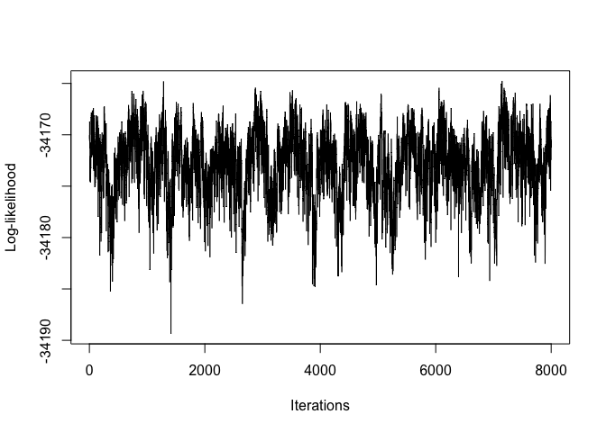
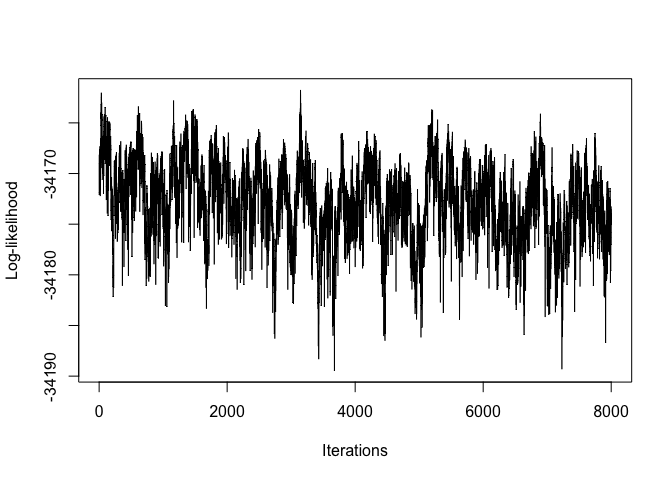

<!-- README.md is generated from README.Rmd. Please edit that file -->

# MR.RGM

<!-- badges: start -->

[](https://github.com/bitansa/MR.RGM/actions/workflows/R-CMD-check.yaml)
<!-- badges: end -->

## Intended use of the package

## Intended use of the package

The MR.RGM R package presents a crucial advancement in Mendelian
randomization (MR) studies, providing a robust solution to a common
challenge. While MR has proven invaluable in establishing causal links
between exposures and outcomes, its traditional focus on single
exposures and specific outcomes can be limiting. Biological systems
often exhibit complexity, with interdependent outcomes influenced by
numerous factors. MR.RGM introduces a network-based approach to MR,
allowing researchers to explore the broader causal landscape.

With two available functions, RGM and NetworkMotif, the package offers
versatility in analyzing causal relationships. RGM primarily focuses on
constructing causal networks among response variables and between
responses and instrumental variables. On the other hand, NetworkMotif
specializes in quantifying uncertainty for given network structures
among response variables.

RGM accommodates both individual-level data and two types of
summary-level data, making it adaptable to various data availability
scenarios. In addition, RGM optionally allows the inclusion of observed
covariates, enabling adjustment for measured confounders when such
information is available. Covariates can be incorporated using either
individual-level data or corresponding summary-level matrices.

This adaptability enhances the package’s utility across different
research contexts. The outputs of RGM include estimates of causal
effects, adjacency matrices, and other relevant parameters. When a full
error variance–covariance structure is estimated, off-diagonal elements
may be interpreted as evidence of unmeasured confounding between
response variables. Together, these outputs contribute to a deeper
understanding of the intricate relationships within complex biological
networks, thereby enriching insights derived from MR studies.

## Installation instructions

You can install MR.RGM R package from CRAN with:

``` r

    install.packages("MR.RGM")
```

Once the MR.RGM package is installed load the library in the R
work-space.

``` r

     library("MR.RGM")
```

## Example

We offer a concise demonstration of the capabilities of the RGM function
within the package, showcasing its effectiveness in estimating causal
interactions among response variables, between responses and
instrumental variables, and—when available—between responses and
observed covariates, using simulated data sets. The examples illustrate
the use of RGM with individual-level data, summary-level data, and
alternative error variance structures.

Subsequently, we provide an example of how NetworkMotif can be applied,
utilizing a specified network structure and the posterior samples
(GammaPst) obtained from executing the RGM function.

``` r

# Model: Y = AY + BX + CU + E

# Set seed
set.seed(9154)

# Number of data points
n = 30000

# Number of response variables, instruments, and covariates
p = 5
k = 6
l = 2

# Initialize causal interaction matrix between response variables
A = matrix(sample(c(-0.1, 0.1), p^2, replace = TRUE), p, p)

# Diagonal entries of A matrix will always be 0
diag(A) = 0

# Make the network sparse
A[sample(which(A != 0), length(which(A != 0)) / 2)] = 0

# Create D matrix (Indicator matrix: rows = responses, cols = instruments)
D = matrix(0, nrow = p, ncol = k)

# Manually assign values to D matrix
D[1, 1:2] = 1
D[2, 3]   = 1
D[3, 4]   = 1
D[4, 5]   = 1
D[5, 6]   = 1

# Initialize B matrix (instrument effects)
B = matrix(0, p, k)
for (i in 1:p) {
  for (j in 1:k) {
    if (D[i, j] == 1) {
      B[i, j] = 1
    }
  }
}

# Generate covariate data matrix U (n x l)
U = matrix(rnorm(n * l), nrow = n, ncol = l)

# Initialize C matrix (covariate effects)
C = matrix(0, p, l)
C[sample(length(C), size = ceiling(length(C) / 2))] = 1

# Create a full (non-diagonal) positive definite error covariance matrix Sigma
R = matrix(rnorm(p * p), p, p)
Sigma = crossprod(R)                 # SPD
# Sigma = Sigma / mean(diag(Sigma))    # scale for stability

# Compute (I - A)^{-1}
Mult_Mat = solve(diag(p) - A)

# Variance of Y
Variance = Mult_Mat %*% Sigma %*% t(Mult_Mat)

# Generate instrument data matrix X
X = matrix(runif(n * k, 0, 5), nrow = n, ncol = k)

# Initialize response data matrix Y
Y = matrix(0, nrow = n, ncol = p)

# Generate response data
for (i in 1:n) {
  mu_i = Mult_Mat %*% (B %*% X[i, ] + C %*% U[i, ])
  Y[i, ] = MASS::mvrnorm(n = 1, mu = mu_i, Sigma = Variance)
}

# Print true causal interaction matrices
A
#>      [,1] [,2] [,3] [,4] [,5]
#> [1,]  0.0 -0.1  0.0  0.0  0.1
#> [2,]  0.1  0.0 -0.1  0.1  0.1
#> [3,]  0.0 -0.1  0.0  0.0  0.1
#> [4,]  0.0 -0.1  0.0  0.0  0.0
#> [5,]  0.0  0.1  0.0  0.0  0.0
B
#>      [,1] [,2] [,3] [,4] [,5] [,6]
#> [1,]    1    1    0    0    0    0
#> [2,]    0    0    1    0    0    0
#> [3,]    0    0    0    1    0    0
#> [4,]    0    0    0    0    1    0
#> [5,]    0    0    0    0    0    1
C
#>      [,1] [,2]
#> [1,]    1    0
#> [2,]    1    0
#> [3,]    0    1
#> [4,]    0    0
#> [5,]    1    1
```

We will now apply RGM using individual-level data and summary-level data
to demonstrate its functionality.

``` r

# ---------------------------------------------------------
# Apply RGM on individual-level data with covariates (Spike and Slab prior)
# Model: Y = AY + BX + CU + E

Output1 = RGM(
  X = X, Y = Y, U = U,
  D = D, nIter = 50000, nBurnin = 10000, Thin = 10,
  prior = "Spike and Slab",
  SigmaStarModel = "IW"
)

# ---------------------------------------------------------
# Compute summary-level quantities (including covariates)
Syy = crossprod(Y) / n        # t(Y) %*% Y / n
Syx = t(Y) %*% X / n
Sxx = crossprod(X) / n        # t(X) %*% X / n

Syu = t(Y) %*% U / n
Sxu = t(X) %*% U / n
Suu = crossprod(U) / n        # t(U) %*% U / n

# Apply RGM on summary-level data with covariates (Spike-and-Slab prior)
Output2 = RGM(
  Syy = Syy, Syx = Syx, Sxx = Sxx,
  Syu = Syu, Sxu = Sxu, Suu = Suu,
  D = D, n = n, nIter = 50000, nBurnin = 10000, Thin = 10,
  prior = "Spike and Slab",
  SigmaStarModel = "SSSL"
)
```

We get the estimated causal interaction matrix between response
variables in the following way:

``` r

Output1$AEst
#>              [,1]        [,2]        [,3]       [,4]       [,5]
#> [1,]  0.000000000 -0.05071349 -0.03122890 0.01580550 0.06439107
#> [2,]  0.092102038  0.00000000 -0.03678640 0.05943408 0.15833616
#> [3,]  0.001739301 -0.03282699  0.00000000 0.02531819 0.04212612
#> [4,] -0.004913130 -0.15241568  0.04659638 0.00000000 0.03834960
#> [5,]  0.000000000  0.13821674 -0.02972008 0.02075432 0.00000000
Output2$AEst
#>              [,1]        [,2]         [,3]         [,4]        [,5]
#> [1,]  0.000000000 -0.08518482 -0.007989256 -0.000943272 0.097420049
#> [2,]  0.089416927  0.00000000 -0.082740175  0.098186881 0.127370800
#> [3,]  0.007209473 -0.08076286  0.000000000 -0.000480574 0.077790630
#> [4,] -0.003015542 -0.11865619  0.022769278  0.000000000 0.003440523
#> [5,]  0.005426684  0.10729912 -0.002202036  0.001646208 0.000000000
```

We get the estimated causal network structure between the response
variables in the following way:

``` r

Output1$zAEst
#>      [,1] [,2] [,3] [,4] [,5]
#> [1,]    0    1    0    0    1
#> [2,]    1    0    1    1    1
#> [3,]    0    1    0    0    0
#> [4,]    0    1    0    0    0
#> [5,]    0    1    0    0    0
Output2$zAEst
#>      [,1] [,2] [,3] [,4] [,5]
#> [1,]    0    1    0    0    1
#> [2,]    1    0    1    1    1
#> [3,]    0    1    0    0    1
#> [4,]    0    1    0    0    0
#> [5,]    0    1    0    0    0
```

We get the estimated causal interaction matrix between the response and
the instrument variables from the outputs in the following way:

``` r

Output1$BEst
#>          [,1]      [,2]      [,3]      [,4]      [,5]      [,6]
#> [1,] 0.995561 0.9951917 0.0000000 0.0000000 0.0000000 0.0000000
#> [2,] 0.000000 0.0000000 0.9225429 0.0000000 0.0000000 0.0000000
#> [3,] 0.000000 0.0000000 0.0000000 0.9522093 0.0000000 0.0000000
#> [4,] 0.000000 0.0000000 0.0000000 0.0000000 0.9851361 0.0000000
#> [5,] 0.000000 0.0000000 0.0000000 0.0000000 0.0000000 0.9614003
Output2$BEst
#>           [,1]      [,2]      [,3]      [,4]     [,5]      [,6]
#> [1,] 0.9939785 0.9947419 0.0000000 0.0000000 0.000000 0.0000000
#> [2,] 0.0000000 0.0000000 0.9774769 0.0000000 0.000000 0.0000000
#> [3,] 0.0000000 0.0000000 0.0000000 0.9832112 0.000000 0.0000000
#> [4,] 0.0000000 0.0000000 0.0000000 0.0000000 1.002278 0.0000000
#> [5,] 0.0000000 0.0000000 0.0000000 0.0000000 0.000000 0.9786314
```

We get the estimated graph structure between the response and the
instrument variables from the outputs in the following way:

``` r

Output1$zBEst
#>      [,1] [,2] [,3] [,4] [,5] [,6]
#> [1,]    1    1    0    0    0    0
#> [2,]    0    0    1    0    0    0
#> [3,]    0    0    0    1    0    0
#> [4,]    0    0    0    0    1    0
#> [5,]    0    0    0    0    0    1
Output2$zBEst
#>      [,1] [,2] [,3] [,4] [,5] [,6]
#> [1,]    1    1    0    0    0    0
#> [2,]    0    0    1    0    0    0
#> [3,]    0    0    0    1    0    0
#> [4,]    0    0    0    0    1    0
#> [5,]    0    0    0    0    0    1
```

The estimated causal effects of covariates on the response variables are
got in the following way:

``` r

Output1$CEst
#>              [,1]        [,2]
#> [1,]  0.975724789  0.08222144
#> [2,]  0.929505309 -0.13509568
#> [3,] -0.007161566  1.06636644
#> [4,]  0.028972576 -0.10922169
#> [5,]  0.958154798  1.03687457
Output2$CEst
#>             [,1]        [,2]
#> [1,] 0.978004115  0.02280010
#> [2,] 0.971112347 -0.05197381
#> [3,] 0.001827472  1.02906778
#> [4,] 0.025793746 -0.04766733
#> [5,] 0.987528882  1.00505903
```

We can plot the log-likelihoods from the outputs in the following way:

``` r

plot(Output1$LLPst, type = 'l', xlab = "Iterations", ylab = "Log-likelihood")
```



``` r
plot(Output2$LLPst, type = 'l', xlab = "Iterations", ylab = "Log-likelihood")
```



Next, we present the implementation of the NetworkMotif function. We
begin by defining a random subgraph among the response variables.
Subsequently, we collect GammaPst arrays from various outputs and
proceed to execute NetworkMotif based on these arrays.

``` r

# Define a function to create smaller arrowheads
smaller_arrowheads <- function(graph) {
  igraph::E(graph)$arrow.size = 0.60  # Adjust the arrow size value as needed
  return(graph)
}

# Start with a random subgraph
Gamma = matrix(0, nrow = p, ncol = p)
Gamma[5, 2] = Gamma[3, 5] = Gamma[2, 3] = 1

# Plot the subgraph to get an idea about the causal network
plot(smaller_arrowheads(igraph::graph_from_adjacency_matrix(Gamma,
       mode = "directed")), layout = igraph::layout_in_circle,
          main = "Subgraph")
```


``` r


# Store the GammaPst arrays from outputs
GammaPst1 = Output1$GammaPst
GammaPst2 = Output2$GammaPst

# Get the posterior probabilities of Gamma with these GammaPst matrices
NetworkMotif(Gamma = Gamma, GammaPst = GammaPst1)
#> [1] 0.22825
NetworkMotif(Gamma = Gamma, GammaPst = GammaPst2)
#> [1] 0.32175
```

## Expanded Simulation Setup

In real-world scenarios, it is common to encounter a large number of
instrumental variables (IVs), each explaining only a small proportion of
the trait variance. To better reflect this, we have expanded our
simulation setup with the following new elements:

1.  **Initial Setup with Numerous IVs:**
    - We start with $100$ IVs for each response variable, each IV having
      a small effect on the trait. This setup mimics the situation where
      each IV contributes minimally to the overall trait variance, as
      often observed in real GWAS studies.
2.  **Dimensionality Reduction:**
    - **Principal Component Analysis (PCA):** To manage the high
      dimensionality of the data and focus on the most significant
      aspects of the variance, we perform PCA on each set of SNPs
      associated with a response variable.
    - We select the top $20$ principal components (PCs) from each PCA.
      This step helps in reducing the complexity of the data while
      retaining the key features that explain the majority of the
      variance.
3.  **Compact Data Matrix:**
    - **Creation of `compact_X`:** By combining the top PCs from each
      response variable, we form a condensed matrix `compact_X`. This
      matrix aggregates the instrumental variables into a more
      manageable form, facilitating a more efficient analysis.
4.  **Revised Summary Level Data:**
    - Using `compact_X`, we calculate new summary level data
      (`Sxx_compact` and `Syx_compact`) for the RGM function
      application. This approach provides a more realistic
      representation of the instrumental variables’ effects in scenarios
      with many IVs explaining only a small proportion of the variance.

Here is the updated R code reflecting these changes:

``` r

# (No covariates in this example) Model: Y = AY + BX + E

# Load necessary libraries
library(MASS)
library(igraph)
#> Warning: package 'igraph' was built under R version 4.3.3
#> 
#> Attaching package: 'igraph'
#> The following objects are masked from 'package:stats':
#> 
#>     decompose, spectrum
#> The following object is masked from 'package:base':
#> 
#>     union

# Set seed for reproducibility
set.seed(9154)

# Number of data points
n = 10000

# Number of response variables
p = 5

# Number of SNPs per response variable
num_snps_per_y = 100

# Total number of SNPs
k = num_snps_per_y * p

# Initialize causal interaction matrix between response variables
A = matrix(sample(c(-0.1, 0.1), p^2, replace = TRUE), p, p)
diag(A) = 0
A[sample(which(A != 0), length(which(A != 0)) / 2)] = 0

# Create D matrix (Indicator matrix where each row corresponds to a response variable
# and each column corresponds to an instrument variable)
D = matrix(0, nrow = p, ncol = k)

# Assign values to D matrix using a loop
for (run in 1:p) {
  
  D[run, ((run - 1) * num_snps_per_y + 1) : (run * num_snps_per_y)] = 1
  
}

# Initialize B matrix
B = matrix(0, p, k)  # Initialize B matrix with zeros

# Calculate B matrix based on D matrix
for (i in 1:p) {
   for (j in 1:k) {
     if (D[i, j] == 1) {
       B[i, j] = 1  # Set B[i, j] to 1 if D[i, j] is 1
     }
   }
 }


# Calculate Variance-Covariance matrix
# Error variance model used to generate Y (diagonal => independent errors across responses)
Sigma = diag(p)
Mult_Mat = solve(diag(p) - A)
Variance = Mult_Mat %*% Sigma %*% t(Mult_Mat)

# Generate instrument data matrix (X)
X = matrix(rnorm(n * k, 0, 1), nrow = n, ncol = k)

# Initialize response data matrix (Y)
Y = matrix(0, nrow = n, ncol = p)

# Generate response data matrix based on instrument data matrix
for (i in 1:n) {
    Y[i, ] = MASS::mvrnorm(n = 1, Mult_Mat %*% B %*% X[i, ], Variance)
}

# Calculate summary level data
Syy = t(Y) %*% Y / n
Syx = t(Y) %*% X / n
Sxx = t(X) %*% X / n

# PCA-based IV compression:
# mimic many weak SNP instruments per response; keep top PCs to reduce dimension
# Perform PCA for each response variable to get top 20 PCs
top_snps_list = list()
for (i in 1:p) {
    X_sub = X[, (num_snps_per_y * (i - 1) + 1):(num_snps_per_y * i)]
    pca = prcomp(X_sub, center = TRUE, scale. = TRUE)
    top_20_pcs = pca$x[, 1:20]
    top_snps_list[[i]] = top_20_pcs
}

# Combine the top PCs from all response variables
compact_X = do.call(cbind, top_snps_list)

# Calculate summary level data based on compact_X
Sxx_compact = t(compact_X) %*% compact_X / n
Syx_compact = t(Y) %*% compact_X / n

# Create D_New
D_New = matrix(0, nrow = p, ncol = 20 * p)

# Assign values to D matrix using a loop
for (run in 1:p) {
  
  D_New[run, ((run - 1) * 20 + 1) : (run * 20)] = 1
  
}

# Apply RGM on summary-level data (Spike-and-Slab prior)
# Since errors were generated independently (Sigma diagonal), set SigmaStarModel = "diagonal"
Output = RGM(Syy = Syy, Syx = Syx_compact, Sxx = Sxx_compact, D = D_New, n = n, prior = "Spike and Slab", SigmaStarModel = "diagonal")

# Print estimated causal interaction matrices
Output$AEst
#>               [,1]        [,2]         [,3]         [,4]       [,5]
#> [1,]  0.0000000000 -0.10304239  0.012795897  0.006911765 0.09119095
#> [2,]  0.1102430697  0.00000000 -0.101718794  0.095093965 0.10762267
#> [3,] -0.0039579652 -0.10801784  0.000000000 -0.008388722 0.10255348
#> [4,] -0.0013919956 -0.09076408  0.011536478  0.000000000 0.01075220
#> [5,] -0.0005533104  0.10848253 -0.002160112 -0.011725145 0.00000000
Output$zAEst
#>      [,1] [,2] [,3] [,4] [,5]
#> [1,]    0    1    0    0    1
#> [2,]    1    0    1    1    1
#> [3,]    0    1    0    0    1
#> [4,]    0    1    0    0    0
#> [5,]    0    1    0    0    0

# Create a layout for multiple plots
par(mfrow = c(1, 2))

smaller_arrowheads <- function(graph) {
  igraph::E(graph)$arrow.size <- 0.6
  graph
}

# Plot the true causal network
plot(smaller_arrowheads(igraph::graph_from_adjacency_matrix((A != 0) * 1, mode = "directed")),
     layout = igraph::layout_in_circle, main = "True Causal Network")

# Plot the estimated causal network
plot(Output$Graph, main = "Estimated Causal Network")
```


**Conclusion**

Although we have mimicked a realistic setting in which there are many
instrumental variables (IVs), each explaining only a small fraction of
the trait variance, our approach continues to yield very promising
results. This demonstrates that MR.RGM is robust even in complex,
high-dimensional scenarios commonly encountered in modern Mendelian
randomization studies.

The dimensionality reduction strategy adopted here—using Principal
Component Analysis (PCA) to extract a compact set of representative
instruments—proves to be effective in stabilizing inference while
preserving relevant variation. This workflow is broadly applicable to
settings with large numbers of weak or correlated IVs, such as
genome-wide association studies (GWAS).

More generally, by combining flexible causal network modeling with
principled dimensionality reduction, MR.RGM provides a practical and
scalable framework for investigating complex causal relationships in
high-dimensional biological systems.

## References

Yang Ni. Yuan Ji. Peter Müller. “Reciprocal Graphical Models for
Integrative Gene Regulatory Network Analysis.” Bayesian Anal. 13 (4)
1095 - 1110, December 2018. <https://doi.org/10.1214/17-BA1087>
